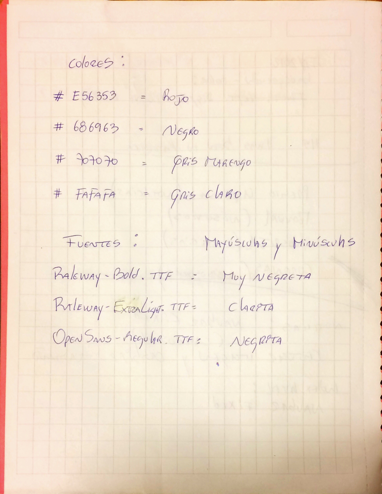
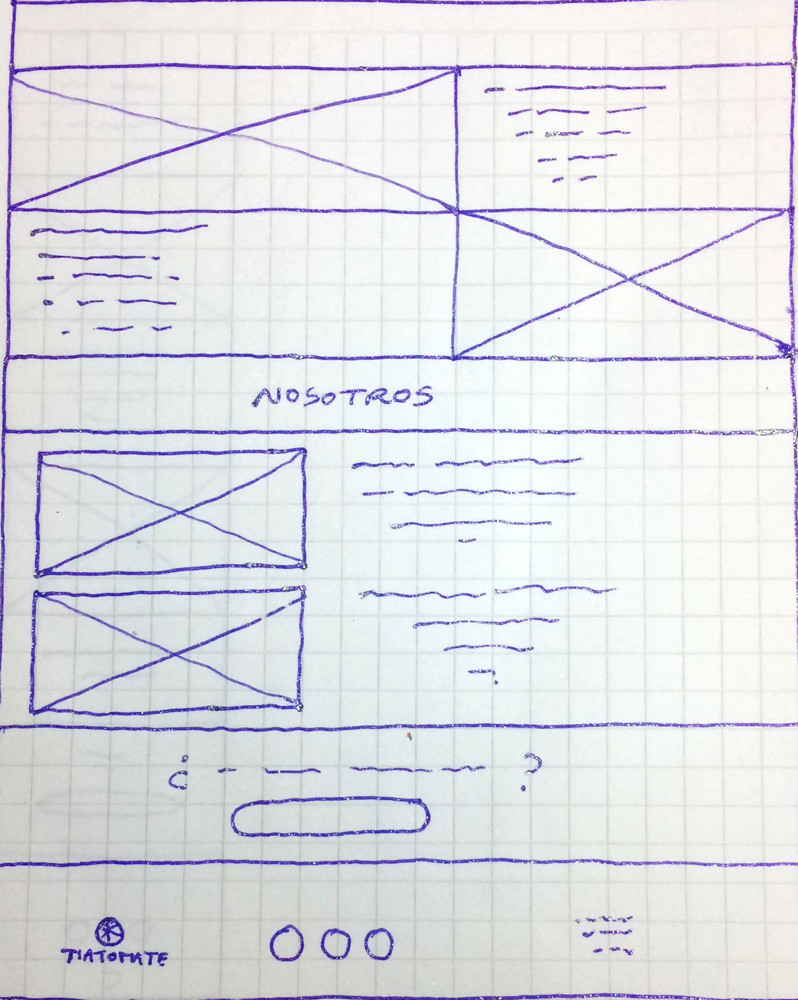
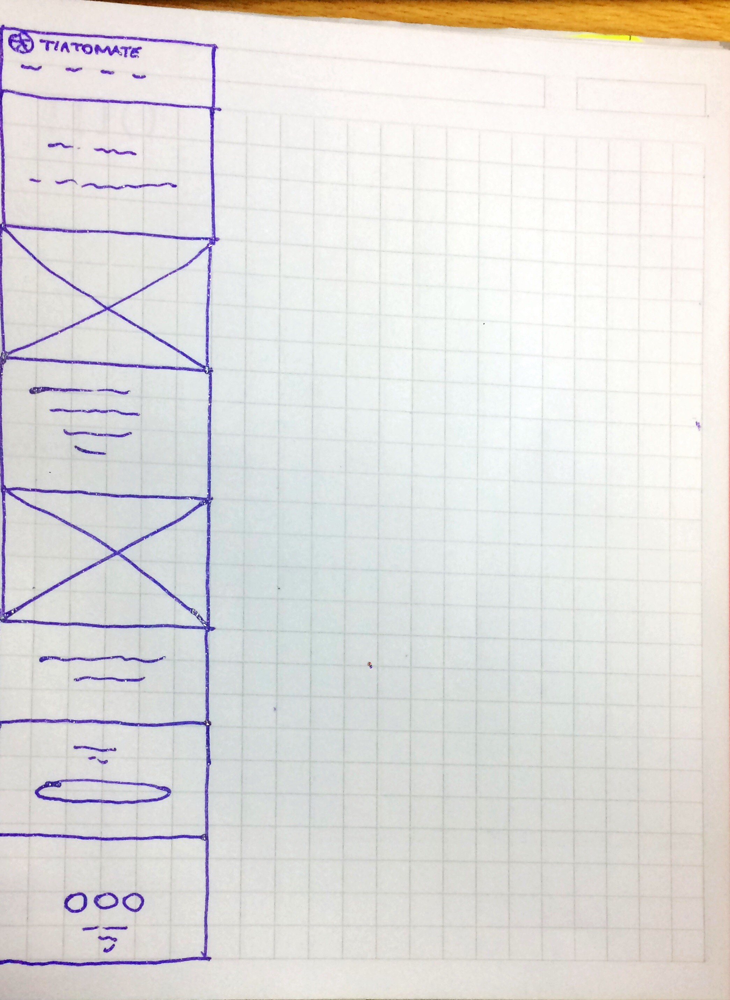
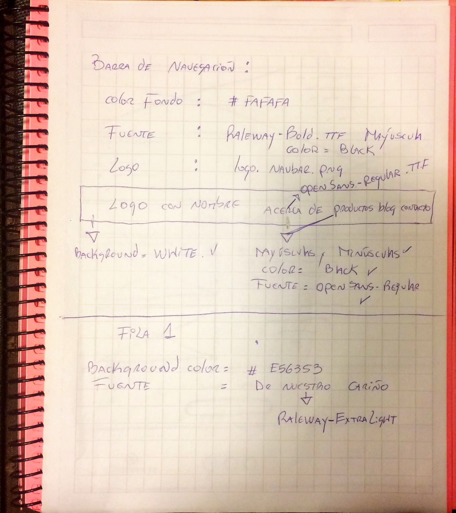

https://github.com/sundarkaur/Desfio-9

# Proceso de maquetación:
## Organizacion de todos los antecedentes;
### REQUERIMIENTOS:
###La empresa productora de tomates orgánicos llamada Tía Tomate pide crear una maqueta de la página "acerca de".

###En ella desean mostrar a sus clientes una pequeña reseña sobre su historia, la procedencia de sus productos y mostrar a las personas que trabajan cosechando estas verduras.

###Según sus requerimientos la página debe:

###Ser responsiva,Mostrar la pasión que sienten por sus tomates,Dar enfásis a la compra de sus productos,Mostrar el logo de la empresa. El diseñador del mockup envío una guía de estilos con las imágenes.
###Además, ellos comentan que crearán el contenido de su página web con la persona encargadade mantener sus redes sociales.

## Tiniendo todo esto en cuenta, hice un listado con los antecedentes como; colores, fuentes, imágenes. Y anoté dichos códigos o nombres. Y posteriormente relicé los bocetos.

## Armé la carpeta para el proyecto, con todos los componentes para comenzar a trabajar en mi editor de texto.
## Empecé por la estructura del HTML, incorporando códigos de Bootstraps que seleccioné anteriomente, y creé el archivo.
## Creé un nuevo archivo para los códigos CSS.
## Y con todo dispuesto comencé a realizar el Blog.

